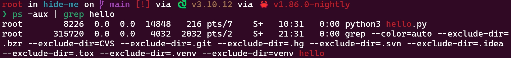
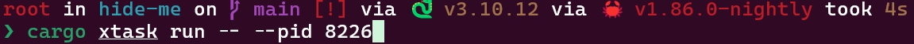
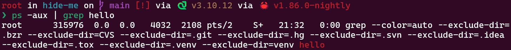

# process hide

## Prerequisites

1. Install bpf-linker: `cargo install bpf-linker`

## Build eBPF

```bash
cargo xtask build
```

To perform a release build you can use the `--release` flag.
You may also change the target architecture with the `--target` flag.

## Run

```bash
RUST_LOG=info cargo xtask run -- --pid 123456
```

It will also help you open the LOG functions.

## Description and filtering methods of pid and tgid（Although we not use them this time）

[如何在 BPF 程序中正确地按照 PID 过滤？](https://www.ebpf.top/post/ebpf_prog_pid_filter/)

## How to check paramaters in system call

```bash
cat /sys/kernel/debug/tracing/events/syscalls/sys_enter_getdents64/format

cat /sys/kernel/debug/tracing/events/syscalls/sys_exit_getdents64/format
```

## Function of this project

It can hide the pid of our rootkits.
Although it is just a toy now.



